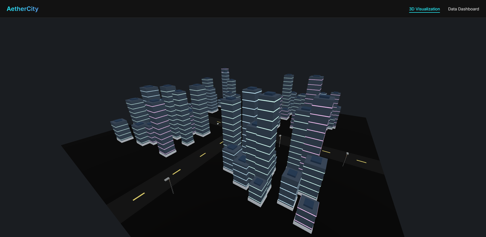
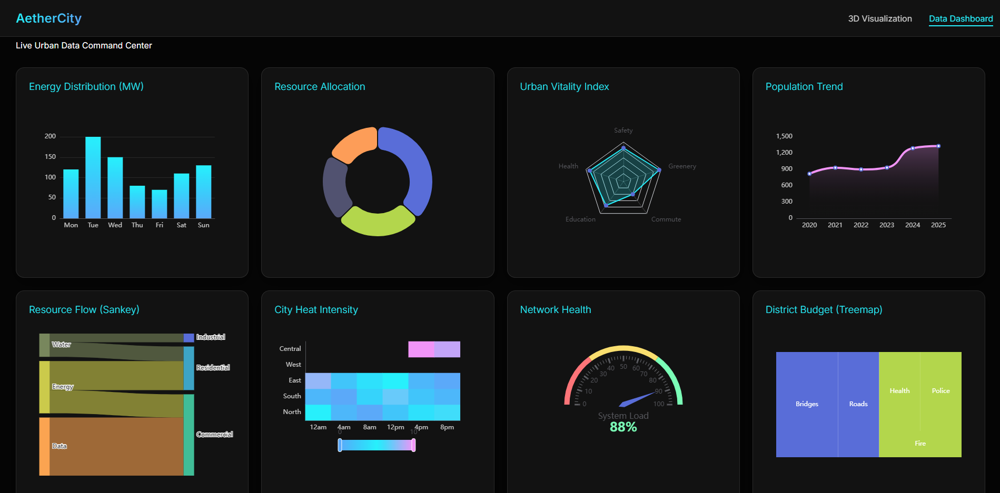

# 🏙️ Smart City Visualization Dashboard

A high-fidelity, real-time 3D urban visualization built with **Angular**, **Three.js (via Angular Three)**, and **Apache ECharts**. This project demonstrates industry-standard practices for "Enterprise Graphics" and "Smart Infrastructure Monitoring."




## 🚀 Quick Start

1. **Install Dependencies**:
   ```bash
   npm install
   ```

2. **Run Development Server**:
   ```bash
   npm start
   ```
   Navigate to `http://localhost:4200/`.

## 🏗️ Technical Architecture

The application uses a **Layered UI Pattern**:
*   **Background Layer**: A full-page Three.js canvas rendering a procedural 'Smart City'.
*   **Interaction Layer**: A glassmorphic dashboard overlay featuring 9 distinct ECharts visualizations.
*   **Routing**: Clean separation between the full 3D experience (`/3d`) and the data-heavy analytics view (`/dashboard`).

## 🛠️ Key Technologies

*   **Framework**: Angular 18 (Standalone Components)
*   **3D Engine**: [Angular Three (A3)](https://angular-three.netlify.app/) - A bridge between Angular and Three.js.
*   **Charts**: [ngx-echarts](https://www.npmjs.com/package/ngx-echarts) - High-performance SVG/Canvas charting.
*   **Styling**: Vanilla CSS with modern Glassmorphism and Dark Mode aesthetics.

<!-- ## 💡 Industrial Design "Tricks" & Best Practices

During development, several complex Three.js integration challenges were solved:

### 1. The "Structural Args" Pattern
In Angular Three v1, Three.js constructor arguments (like camera/renderer for OrbitControls) MUST be passed using the structural directive syntax:
```html
<ngt-orbit-controls *args="[camera, gl]"></ngt-orbit-controls>
```
*Missing the asterisk `*` or using square brackets `[]` will cause `NG0201: No provider for TemplateRef` errors.*

### 2. Safeguarding 3D Initialization
Three.js objects often depend on the Global Store (Camera, Renderer). To avoid "undefined position" errors, always wrap interactive components in `@if` guards:
```html
@if (camera$ | async; as camera) {
  <ngt-orbit-controls *args="[camera, gl]"></ngt-orbit-controls>
}
```

### 3. Performance Animation Loop
For 60FPS traffic simulations, avoid Angular Change Detection. Use the Three.js render loop directly via the `(beforeRender)` event to manipulate `object.position` without overhead.

### 4. Custom Elements & Schemas
Since Three.js tags (`<ngt-mesh>`, etc.) are not standard HTML, you must add `CUSTOM_ELEMENTS_SCHEMA` and `NO_ERRORS_SCHEMA` to your component decorators to prevent Angular from throwing template errors.

### 5. Procedural City Generation
Unlike traditional 3D apps that load heavy `.gltf` or `.obj` files, this project uses **Procedural Generation**. 
*   **Advantage**: Instant load times, zero external asset dependencies, and the ability to scale the city indefinitely via code (using `@for` loops).
*   **Visual Logic**: Buildings are built using layered meshes for windows and roofs, allowing for dynamic lighting and accent color randomization per instance.

### 6. Industrial Aesthetic Palette
*   **Buildings**: Use metallic Slate Grey (`#5D6D7E`) with concrete bases (`#AEB6BF`) to avoid flat black silhouettes.
*   **Lighting**: Combined Ambient (high intensity) + Directional + PointLights (for street lamps) to create depth.
*   **Fog**: Use `ngt-fog` to blend the city edges into the background for a premium "Infinite City" feel. -->

## 📊 Dashboard Modules
*   **Real-time Heatmaps**: Urban density tracking.
*   **Gauge Clusters**: Infrastructure health monitoring.
*   **Scatter Plots**: Predictive maintenance data.
*   **Tree Maps**: Resource allocation distribution.

## ⚙️ Build Optimization
The `angular.json` is configured with increased budgets (2MB+) to accommodate the concurrent usage of Three.js and ECharts in the same application bundle.

---
**Developed for Advanced Angular Graphics Training.**
